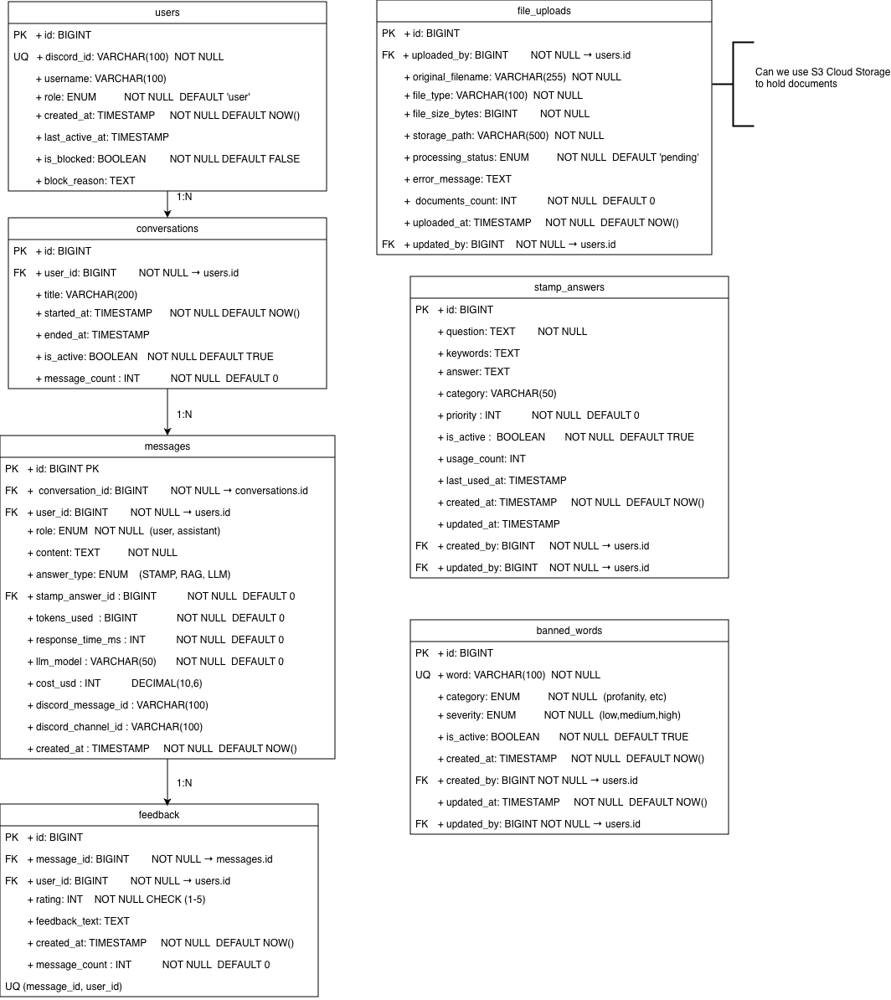

# team12-chatbot-api

Project root README.

## Diagrams

- **ERD files:** [SVG](./docs/diagrams/chatbot_erd.svg) | [PNG](./docs/diagrams/chatbot_erd.png)
- **ERD draw.io source:** [Open in draw.io](https://app.diagrams.net/#G1Ix1IFXWZ0Rpvn5BVM68P6WLOcQkdWP59#%7B%22pageId%22%3A%22KjJnbeDkw62hERHSN6ZB%22%7D)
- **ERD (preview):** 

## Commands

Use these commands from the repository root or the `bossbot` module directory.

- Prerequisite (for macOS): set Java if needed

```bash
# auto-select installed Java 25 if available
export JAVA_HOME=$(/usr/libexec/java_home -v 25)
export PATH=$JAVA_HOME/bin:$PATH

# OR explicit path (example for Temurin 25)
export JAVA_HOME=/Library/Java/JavaVirtualMachines/temurin-25.jdk/Contents/Home
export PATH=$JAVA_HOME/bin:$PATH
```

- Build `bossbot` module (skip tests for faster build)

```bash
cd bossbot
./mvnw clean package -DskipTests
```

- Build from repository root (only `bossbot` module)

```bash
./mvnw -pl bossbot -am clean package -DskipTests
```

- Run (development using Maven)

```bash
# recommended: load repository `.env` then run from the module
# from the repository root
set -a; source .env; set +a
cd bossbot
./mvnw spring-boot:run

# IMPORTANT: Make sure your .env has SPRING_PROFILES_ACTIVE=local (or omit it entirely)

# if you're already inside the `bossbot` folder, load the repo `.env` from the parent
set -a; source ../.env; set +a
./mvnw spring-boot:run

# run with debug logging (inside `bossbot`)
set -a; source ../.env; set +a
./mvnw spring-boot:run -Dspring-boot.run.arguments="--debug"

# one-shot environment override (run from repo root or any cwd)
SPRING_DATASOURCE_URL=jdbc:postgresql://localhost:5432/bossbot \
SPRING_DATASOURCE_USERNAME=postgres \
SPRING_DATASOURCE_PASSWORD=postgres \
./mvnw -pl bossbot -am spring-boot:run -Dspring-boot.run.arguments="--debug"
```

- Run packaged jar

```bash
cd bossbot
./mvnw package -DskipTests
java -jar target/*.jar
```

- Run tests (unit/integration for `bossbot`)

Tests automatically use the `test` profile with H2 in-memory database — no external DB required.

```bash
cd bossbot
./mvnw test
```

- Run a single test class or method

```bash
# run a test class
./mvnw -Dtest=StampAnswerControllerTest test

# run a single test method
./mvnw -Dtest=StampAnswerControllerTest#yourTestMethodName test
```

- Run with Docker Compose (containerized)

```bash
docker-compose up --build
```

## Docker (recommended)

This project includes a `docker-compose.yaml` that starts a Postgres database, Ollama (for RAG-based stamp answer matching), and the backend. The backend is exposed on port `8080` on the host.

- Ensure Docker Desktop is installed and running (for macOS):

```bash
brew install --cask docker
open /Applications/Docker.app
```

- Start services with Compose:

```bash
docker compose up --build
```

- Helpful compose commands:

```bash
docker compose ps
docker compose logs -f backend
docker compose logs -f postgres
docker compose logs -f ollama
docker compose down
```

Notes:

- The `postgres` service is available to the backend container at host `postgres:5432` (the compose file maps the host port `5433` to the container `5432`).
- The `ollama` service runs a local LLM server for semantic stamp answer matching. On first startup, `ollama-init` automatically pulls the `nomic-embed-text` embedding model (~274MB). The model is persisted in a Docker volume, so subsequent startups are instant.
- If you prefer running the backend locally instead of in Compose, export the vars from `.env` first (`set -a; source .env; set +a`) and then run `./mvnw -pl bossbot spring-boot:run`.

## Ollama (RAG + Offline Chat)

The chatbot uses **Ollama** for two things:

1. **Semantic stamp answer matching (RAG)** — converts text into vector embeddings to find the closest stamp answer by meaning. For example, "when do you open?" matches "What are our opening hours?" even though they share few words.
2. **Offline chat (replaces OpenAI)** — when no OpenAI API key is set, Ollama runs a local LLM (`llama3.2:3b` by default) for chat responses instead of returning mock responses. No internet connection or API keys needed.

### How it works

1. On startup, all active stamp answers are embedded into vectors using the `nomic-embed-text` model
2. When a user sends a message, it is embedded and compared against all stamp answer vectors
3. If the cosine similarity exceeds the threshold (default 0.7), the stamp answer is returned
4. If no stamp answer matches, the message goes to Ollama's chat model (or OpenAI if configured)
5. If Ollama is unavailable, stamp answer matching falls back to keyword-overlap matching automatically

### With Docker Compose (recommended)

Ollama is included in `docker-compose.yaml`. Just set `OLLAMA_ENABLED=true` in your `.env` and run:

```bash
docker compose up
```

The `ollama-init` service automatically pulls both the embedding model and the chat model on first startup. No manual setup needed.

### Without Docker (local)

```bash
# Install Ollama
brew install ollama

# Start Ollama server
ollama serve

# Pull the models (one-time)
ollama pull nomic-embed-text
ollama pull llama3.2:3b
```

Then set in your `.env`:

```
OLLAMA_ENABLED=true
OLLAMA_URL=http://localhost:11434
```

### Configuration

All Ollama settings are optional and have sensible defaults:

| Environment Variable | Default | Description |
|---|---|---|
| `OLLAMA_ENABLED` | `false` | Enable/disable Ollama (both RAG and chat) |
| `OLLAMA_URL` | `http://localhost:11434` | Ollama server URL |
| `OLLAMA_MODEL` | `nomic-embed-text` | Embedding model for stamp answer matching |
| `OLLAMA_CHAT_MODEL` | `llama3.2:3b` | Chat model for AI responses (used when no OpenAI key is set) |
| `STAMP_MATCHER_SIMILARITY_THRESHOLD` | `0.7` | Minimum cosine similarity for a semantic stamp answer match (0.0-1.0) |
| `STAMP_MATCHER_KEYWORD_THRESHOLD` | `0.3` | Minimum Jaccard similarity for keyword-based matching (0.0-1.0) |
| `STAMP_MATCHER_MIN_INPUT_LENGTH` | `3` | Minimum input length before attempting matching |

### Which AI service is used?

| `openai.api-key` | `ollama.enabled` | AI service |
|---|---|---|
| Set to a real key | any | OpenAI (cloud) |
| `mock` (default) | `true` | Ollama (local) |
| `mock` (default) | `false` | Mock responses (no AI) |

### Disabling Ollama

Set `OLLAMA_ENABLED=false` in `.env` (the default). The backend will use keyword-overlap matching for stamp answers and return mock responses for chat. No external services needed.

## Spring Profiles

The application uses Spring Profiles to separate configuration for different environments:

| Profile  | Purpose                | Database                           | When Used                                                         |
| -------- | ---------------------- | ---------------------------------- | ----------------------------------------------------------------- |
| `local`  | Local development      | PostgreSQL on localhost:5432       | Default when running locally with `./mvnw spring-boot:run`        |
| `docker` | Docker Compose         | PostgreSQL service (postgres:5432) | Automatically set in `docker-compose.yaml`                        |
| `test`   | Unit/Integration tests | H2 in-memory database              | Automatically used by test classes with `@ActiveProfiles("test")` |

**Configuration files:**

- `application.properties` - Base config with `local` as default profile
- `application-local.properties` - Local development (uses `.env` or defaults)
- `application-docker.properties` - Docker Compose (uses Postgres service name)
- `application-test.properties` - Test profile (H2 in-memory, no external DB needed)

**To override the profile:**

```bash
# Run with a specific profile
./mvnw spring-boot:run -Dspring-boot.run.arguments="--spring.profiles.active=local"

# Or set environment variable
export SPRING_PROFILES_ACTIVE=local
./mvnw spring-boot:run
```
## Swagger 

This project has Swagger setup as well and is running on `http://localhost:8080/swagger-ui/index.html`

**Important:** 
Swagger only runs locally, currently its turned off when running in docker - see application-docker.properties.
For Swagger documentation : `http://localhost:8080/v3/api-docs`

## API Endpoints

Once the backend is running (host: `http://localhost:8080` by default), the following endpoints for stamp answersare available under `/api/v1/stamp-answers`:

- List all: GET `http://localhost:8080/api/v1/stamp-answers`
- Get by id: GET `http://localhost:8080/api/v1/stamp-answers/{id}`
- **Get answer by exact question**: GET `http://localhost:8080/api/v1/stamp-answers/by-question?q={question}` (case-insensitive, auto-increments usage count)
- Create: POST `http://localhost:8080/api/v1/stamp-answers` (JSON body)
- Update: PUT `http://localhost:8080/api/v1/stamp-answers/{id}` (JSON body)
- Delete (soft): DELETE `http://localhost:8080/api/v1/stamp-answers/{id}`
- Search: GET `http://localhost:8080/api/v1/stamp-answers/search?q=your+term`
- Most used: GET `http://localhost:8080/api/v1/stamp-answers/most-used`

Example curl requests:

```bash
curl http://localhost:8080/api/v1/stamp-answers
curl http://localhost:8080/api/v1/stamp-answers/1
curl "http://localhost:8080/api/v1/stamp-answers/by-question?q=How%20do%20I%20request%20leave"
curl "http://localhost:8080/api/v1/stamp-answers/search?q=leave"
curl http://localhost:8080/api/v1/stamp-answers/most-used
```

**Note:** `createdBy` and `updatedBy` fields are set automatically by the service layer (currently uses system user ID `1`). When Spring Security is implemented, these will be populated from the authenticated user context.

## Best Practices Followed

1. **Layered Architecture**: Controller → Service → Repository → Entity
2. **DTOs**: Separate request/response objects from entities
3. **Validation**: Jakarta Validation annotations
4. **Lombok**: Reduces boilerplate code
5. **Transactional**: @Transactional for data consistency
6. **Logging**: SLF4J logging throughout
7. **Exception Handling**: Custom exception handling in controller
8. **Testing**: Unit tests with Mockito and MockMvc
9. **RESTful**: Standard HTTP verbs and status codes
10. **Environment Separation**: Spring Profiles for local, Docker, and test configurations
11. **Test Isolation**: H2 in-memory database for tests (no external dependencies)

## Setup backend:

- Create .env file and copy data from .env-example inside it
- Ensure that Docker is running in your computer
- Run `docker compose up`
- Testing, API EP: `GET` `localhost:8080/api/users` gives the list of users (initially created on first run as testusers)

# Liquibase Setup

This project uses Liquibase for database schema migration management with **XML master changelog + SQL migration files**.

## How It Works

- **Runtime**: Liquibase runs automatically on application startup (both local & Docker)
- **Tracking**: Creates `databasechangelog` and `databasechangeloglock` tables
- **Safety**: Each changeSet runs only once (tracked by id + author + filename)
- **No create_database.sql needed**: The database itself is created by Docker Compose (`POSTGRES_DB` env var) or manually for local development. Liquibase manages the **schema** (tables, indexes), not database creation.

### Step 1: Create SQL File

Create a new file: `src/main/resources/db/changelog/sql/00X-description.sql`

### Step 2: Include in Master Changelog

Add to `db.changelog-master.xml`:

```xml
<include file="db/changelog/sql/00X-description.sql" relativeToChangelogFile="false"/>
```

## Important Rules

1. **Never modify existing changeSet files** after they've been applied to any database
2. **Always create new migration files** for schema changes
3. **Include rollback statements** when possible
4. **Test locally first** before pushing to shared environments

## SQL Format Requirements

Each SQL migration file **MUST** start with these exact lines:

```sql
--liquibase formatted sql
--changeset author:unique-id
```

These two lines are required by Liquibase to track which migrations have been run. The `author` can be any string (e.g., your name or team name), and the `unique-id` should be a unique identifier for that changeSet (e.g., a sequential number or descriptive name).

## Rollback

To rollback the last migration:

```bash
./mvnw liquibase:rollback -Dliquibase.rollbackCount=1
```

## Database Creation

Liquibase manages the **schema** (tables, columns, indexes), not database creation.

The database itself is created by:

- **Docker**: `POSTGRES_DB` environment variable in `docker-compose.yaml`
- **Local**: Manually create `bossbot` database before running the app

Liquibase runs **after** the database exists and manages only the schema.